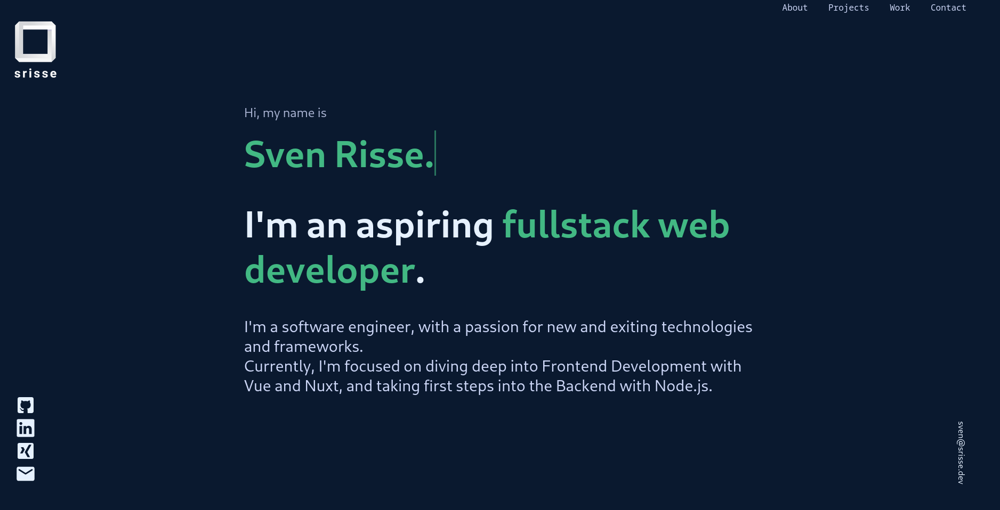

### My Personal Portfolio built with Nuxt and Vue.

Check it out on:
[srisse.dev](https://www.srisse.dev)

Tools used:

-   [Vue](https://vuejs.org/)
-   [Nuxt](https://nuxt.com)
-   [Vite](https://vitejs.dev/)
-   [SCSS](https://sass-lang.com)
-   [Nuxt Icon](https://github.com/nuxt-modules/icon)
